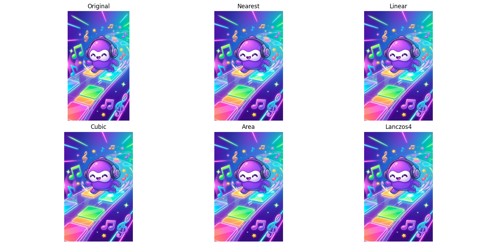

# Project Report: Image Interpolation Case Study

## 1. Project Overview
A modular Python-based pipeline for batch-processing images using various interpolation methods, including an objective evaluation suite using PSNR and SSIM metrics.

## 2. Why Choosing Interpolation Method

**Problem Context**: The task involves resizing vertical images from 1080×1920 to 1200×1920, corresponding to a ~11% width upscale.

**Considered Approaches**:
- Initially explored basic image resizing using `cv2.resize`, but quality was insufficient
- Given the modest resolution increase requirement (~11% for width), OpenCV interpolation proved to be the most efficient and accessible choice
- While Super-Resolution was considered, it would require significantly more processing time for minimal quality improvement at this scale

**Conclusion**: Selected interpolation-based approach as the optimal balance of quality and performance for the given resolution requirements.

## 3. Development Workflow
The project was completed in approximately **2 hours 5 minutes**, evolving through the following stages:

| Phase | Activities | Time Estimate |
| :--- | :--- | :--- |
| **Preparation** | Reading carefully the problem; sourcing and preparing vertical images (1920x1080) via Flow (nano banana pro) and Canva. | 10 mins |
| **Initial Prototyping** | Basic pipeline coding to load and resize a single image. | 5 mins |
| **Interpolation & Viz** | Implementing diverse interpolation methods and Matplotlib visualization. | 10 mins |
| **Batch Logic** | Developing the batch processing functionality and configuration-driven flow. | 10 mins |
| **Evaluation Suite** | Researching and implementing objective metrics (PSNR/SSIM) for quality benchmarking. | 15 mins |
| **Modular Refactor** | Restructuring code into the `src/` library for better maintainability. | 15 mins |
| **Documentation** | Writing comprehensive `README.md` and `REPORT.md` instructions. | 30 mins |
| **Check all repo** | Check carefully all repo and repair all errors | 30 mins |
| **Total** | | **~2 hours 5 minutes** |

---

## 4. Tools Used
- **Vibe Coding**: For metric evaluation.
- **Canva & Flow**: For image preparation. Example prompt used:
  
  
  
- **Antigravity**: For coding assistance

---

## 5. Technical Approach

### Modular Architecture
The codebase is structured into clear, single-responsibility modules:

- `resize_methods.py`: Interpolation definitions and resize logic
- `utils_io.py`: Image loading, validation, and filesystem helpers
- `batch_resize.py`: Batch generation of resized outputs
- `evaluate_methods.py`: Objective quality evaluation
- `main.py`: Entry point for running the batch "Best Method" processing pipeline

### Configuration-Driven Design
A `config.yml` file is used to define:

- Input/output directories
- Target resolution
- Selected interpolation method

This allows users to experiment without modifying source code.

### Evaluation Strategy (Round-Trip Benchmark)
Because no ground-truth 1200×1920 images exist, a round-trip evaluation was adopted:

1. Upscale 1080×1920 → 1200×1920 (candidate method)
2. Downscale back → 1080×1920 using INTER_AREA
3. Compare reconstructed image with the original using PSNR and SSIM

This approach provides a fair and reproducible proxy for quality comparison.

---

## 6. Results

### Quantitative Results
Based on benchmark results, **Lanczos4** and **Cubic** consistently perform the best for upscaling:

```
Ranking (higher PSNR mean is better):
1. Lanczos4 | PSNR mean=46.9653 | SSIM mean=0.998916
2. Cubic    | PSNR mean=46.8666 | SSIM mean=0.998928
3. Linear   | PSNR mean=44.0527 | SSIM mean=0.998137
4. Area     | PSNR mean=38.9005 | SSIM mean=0.995055
5. Nearest  | PSNR mean=34.4333 | SSIM mean=0.986749
```

**Key Findings**:
- Lanczos4 and Cubic show nearly identical performance, with PSNR values above 46 dB
- Both methods achieve SSIM scores above 0.998, indicating excellent structural similarity
- Nearest neighbor performs significantly worse, as expected

### Qualitative Results


---

## 7. Limitations
- **Input Variety**: Limited test dataset (5 images) may not fully represent performance across diverse image types
- **Resolution Scale**: Only tested with ~11% upscaling; results may differ significantly with larger scale factors
- **Metric Scope**: PSNR and SSIM capture fidelity but do not fully reflect perceptual preferences

---

## 8. Future Improvements
- **Concurrency**: Implement multiprocessing in `batch_resize.py` to handle large datasets significantly faster
- **AI-Based Enhancement (Optional)**: Explore lightweight super-resolution models for larger scale factors where interpolation degrades

---

## 9. Final Conclusion
This study demonstrates that for small-resolution upscaling in mobile-oriented pipelines, classical interpolation—particularly **Cubic** and **Lanczos4**—delivers excellent quality at minimal cost.
Example output using Lanczos4 method:

